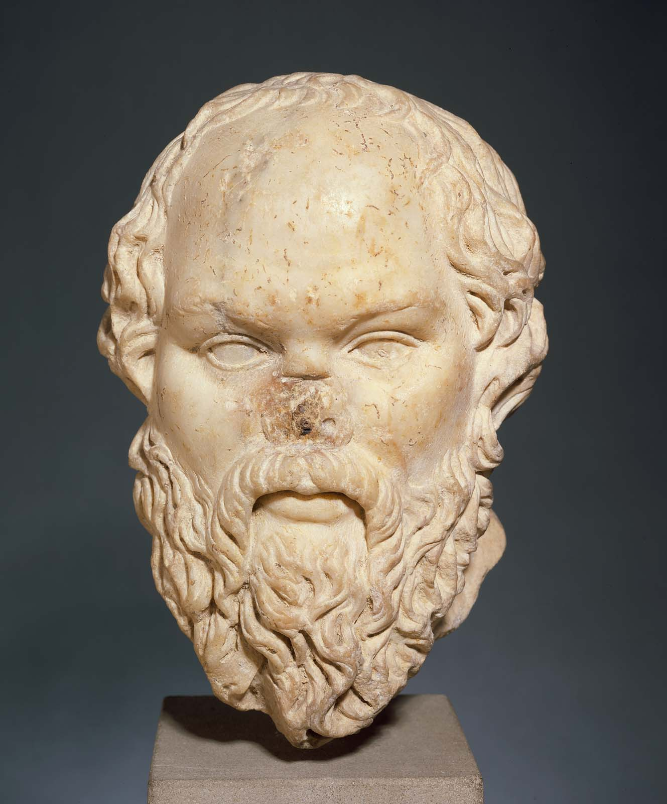

# AI Systems
## Foundations for Artificial Minds


---

# Annotated Slides

https://github.com/benkamphaus/artificial-minds-annotated


---

## Who am I? [ Ben Kamphaus @benkamphaus ]

- I develop software at Cognitect
- Interdisciplinary academic background, professional experience in GIS, satellite imaging, space industry, etc.
- Before my Coming to Clojure moment, programmed in old school numerics langs (MATLAB, IDL, etc.) then Python


---


---

## Who am I? [ Ben Kamphaus @benkamphaus ]

- I develop software at Cognitect
- Interdisciplinary academic background, professional experience in GIS, satellite imaging, space industry, etc.
- Before my Coming to Clojure moment, programmed in old school numerics langs (MATLAB, IDL, etc.) then Python


---

 


---
> _I want to build artificial minds._


---

## Not About


---
## Not About

 


---
## Mind?

- A basis for sense making and goal-directed behavior
- "Artifical Mind" encompasses:
  - Things that get called strong or general AI
  - Beyond the state of the art
  - Non-trivial temporal components
  - Not what my textbook/professor said AI is actually about


---
## How to measure progress?

- How would you know if something actually had a mind?
- How do you know that other people have minds?
- Philosophical behaviorism seems like a favorite punching bag in philosophy of mind
- Behaviorism is an OK empirical constraint


---
## The Voight-Kampff test


_Blade Runner (1982)_


---

## Annotation: Testing Artificial Beings

The fictional [Voight-Kampff](http://bladerunner.wikia.com/wiki/Voight-Kampff_machine) test from Blade Runner.
The original proposal of the [Turing Test](https://www.csee.umbc.edu/courses/471/papers/turing.pdf).
Daniel Dennett makes [arguments in defense](http://www.nyu.edu/gsas/dept/philo/courses/mindsandmachines/Papers/dennettcanmach.pdf) of the Turing Test
both as a genuinely strong test and quite far away still.

* I think it's quite important not to fall into strawman/caricature of the Turing test and the behavioral perspective.


---

> Picture the letters 'jay' and 'dee', now rotate the 'dee' 90 degrees to the left and place it on top of the 'jay' - what weather does this make you think of? 

---

## Annotation: Letters and Weather

This example was from "Philosophy Bites: Daniel Dennett on the Chinese Room", found [here](https://philosophybites.com/2013/06/daniel-dennett-on-the-chinese-room.html)


---

## Solution Components

- Making sense of language
- Multi-modal reasoning
- Mental imagery
- A world model
  - Making sense of experience
  - Making sense of testimony

---

## Machine Learning Advances

- Generative models to go from a category to an image of an instance.
- Deep Convolutional Nets approaches for:
  - abstract -> photoreal
  - abstract -> category (label)
- Linked language and image model as in image captioning.
- Label the scene with respect to weather

----

## Annotations: Machine Learning Pieces

[DCGAN](https://arxiv.org/pdf/1511.06434.pdf) is one example for generating photoreal images from labels.
DeepMind has a [blog post](https://deepmind.com/blog/learning-to-generate-images/) that walks through generating both abstract and photoreal images.
[VQA](http://visualqa.org/) has several datasets/benchmarks for Visual question answering tasks.
Abstract, Photoreal, and Stylized (artistic) are all capabilities of [CycleGAN](https://junyanz.github.io/CycleGAN/) and related approaches.


---

> Think of 'jay' and 'dee', if you put the sideways 'dee' on the 'jay', what kind of weather would you get?


---

> "ONE person dies every FIVE seconds from SMOKING, reveals scientist"


---

> Scientists study whales from space.


---

> What do you get when you cross a joke with a rhetorical question?


---

Annotation: Dad Jokes

The "rhetorical question" joke just happened to be trending on reddit on one of the
days I was working on the presentation, [link](https://www.reddit.com/r/Jokes/comments/9x438s/what_happens_when_you_cross_a_joke_with_a/)

---


# If we want to solve these problems, we need good representations


---

> *MCMXLVIII*


---

## Annotation: Roman numerals

There's a similar example in the Deep Learning textbook, in the [representation learning chapter](https://www.deeplearningbook.org/contents/representation.html)

---

## Good Representations

```clojure
(map inc [1 2 3 4])
```

```clojure
{:person/first-name "Ben"
 :person/last-name "Kamphaus"}
```

```clojure
[123 :person/first-name "Ben" 1000 true]
[123 :person/last-name "Kamphaus" 1000 true]
[123 :person/first-name "Ben" 1001 false]
[123 :person/first-name "Benjamin" 1001 true]
```


---

## Between Two Wittgensteins


   

| Tractatus Logico-Philosophicus | Philosophical Investigations |
| --- | --- |
| "What is the case is the existence of atomic facts." | "The meaning of a word is its use in the language." |


---


---

## Why do this at all?

- Why learn representations?
- Why shove an encoding process in a black-ish box?
- Machine Learning is complicated, and it complects.


---

## Why do humans do it?

- Human learning is a sort of empirical calibration
- It's also (maybe surprisingly) mind-less.
- We don't need empirical calibration for all behaviors.
  - Some things in the brain adapt
  - Some are very precisely targeted and inflexible.


---

## Inductive/empirically derived behavior

- What are the constraints?
- What are the affordances?
  - Time scale (evolutionary versus lifetime)
  - Flexibility
  - What kind of problems are we solving?


---

# Your brain can encode vagueness.


---

What is vagueness?

- it depends
- lack of boundaries
- games and family resemblances
- situational and relational
- not hierarhical
- polysemy (and auto-antonymns! to seed, to dust, sanction)


---

##  Vagueness and the Sorites paradox

### (modern example)

- If a poor person is given a penny, they'll still be poor.
- Therefore if a poor person is given a trillion pennies, they will still be poor.

This is mathematical induction, what's wrong with the _premise_?


---

> Why vagueness at all?


---

> If I want the door to turn, the hinges must stay put (Wittgenstein, On Certainty 341–343)


---

## Bias and Variance

 

_Bias and variance contributing to total error_[^3]

[^3]: Fortmann-Roe (2017)


---

## Examples of Hinges

- Bias side of bias/variance tradeoff
- Assumptions
- Heuristics
- Pruning logic
- Axioms


---

## Hinges lets us get started, make progress

- Formal knowledge entails an infinite regress
- Or solving problems that can't be solved.
- Solving language with formal symbolic computation is not tractable
- These may be approximate
- But the problems are otherwise intractable or unsolvable.
  - Solve rock climbing in terms of muscle fiber contraction.

---

## Annotation: Hinges, Bias, and the Human Condition

There's a good write up on the importance of bias and heuristics in human reasoning in
[this article](https://onlinelibrary.wiley.com/doi/full/10.1111/j.1756-8765.2008.01006.x).

Note: They make a important case about how a good bias increases accuracy by avoiding accomodation of noise. Good filtering is important, not just for efficiency!

As with anything Wittgenstein, there are a lot of [interpretations](https://www.iep.utm.edu/witt-epi/) of his
epistemology comments.

Donald Hoffman makes a reasonably good argument for why human perception doesn't match reality, summarized
[here](https://www.quantamagazine.org/the-evolutionary-argument-against-reality-20160421/).
As with a lot of evolutionary psych/cognitive sci explanations, it's a bit speculative, but I think
the underlying gist, that human perception is like a user interface for human needs, is reasonable.


---

## Life at a Complicated Scale


---

## Natural Data as a Subset of Obseved Dimensionality

 


---

## Natural Data as a Subset of Observed Dimensionality

- asd hjasduazzsd  alsdj  sdhshd ad lkskkksds jasd 
- careful prefer tongue fulfill saponify
- savor invisible nonstop pocket wax
- friends are catapults and llama brigades
- this is however a fully valid English sentence


---

## Manifold Learning _(Oversimplification Zone)_

301 W Morgan as a lower dimensional embedding.


---

## Annotation: The Manifold Learning Hypothesis:

See [Chris Olah's blog](http://colah.github.io/posts/2014-03-NN-Manifolds-Topology/)
See Bengio (2013): [Deep Learning of Representations: Looking Forward](https://arxiv.org/pdf/1305.0445.pdf)
See the Deep Learning textbook, "Machine Learning Basics", [link here](http://www.deeplearningbook.org/version-2015-10-17/contents/ml.html)

---

## What kind of representations are learned in machine learning?

 


---

DCGAN [^1]


[^1]: https://github.com/Newmu/dcgan_code


---

# Word/Token Embedding Affordances

> puppy - dog + cat = kitten
> worst - bad + big = biggest
> king - man + woman = queen
> Paris - France + Italy = Rome
>  Cu - copper + gold = Au
> sushi - Japan + Germany = bratwurst[^2]

[^2]: word2vec, Mikolov et al. (2013)_


---

## Annotation: Vector Spaces

More on vector space embeddings in this [medium post](https://medium.com/artists-and-machine-intelligence/a-journey-through-multiple-dimensions-and-transformations-in-space-the-final-frontier-d8435d81ca51).


---


## There are constraints

> _The unexamined [representation] is not worth [using]._




---


 


Checker Shadow illusion, Edward Adelson.
Scintillating Grid illusion, Schrauf et. al.


---


From _Deep Neural Networks are Easily Fooled_, Nguyen et. al. 2015


---

> Remember that I did not ask you to give me two or three examples of [cat pictures], but to explain the general idea which makes all [cat pictures] out to be [cat pictures]..


---

## Affordances when in Mixed Systems

- Why AlphaGo encodes board states into scores with convolutional neural nets.
- Why self-driving car efforts involve deep nets for visual perception.
- Why interpreting language requires learned language embeddings.


---

# This is a Clojure Conference


---

## Opportunities for Clojure

- Artificial Minds require AI systems
- Artificial Minds require representations that are empirically learned and offer tractable solutions.
- We want to solve (at least some) AI problems in the Clojure community.
- Clojure and Datomic are designed to solve systems problems.


---

## Machine Learning and its Technical Debt

- models (therefore representations) are functions of all the data the model has ever seen
  - maybe some code at that point in time
- data ingest from other systems and others' code snapshots.
- models may depend on each other (or a chain of model outputs)
- model and data dependencies are like code dependencies except worse in every way


---

## Annotation: Machine Learning Technical Debt

The canonical reference, _Machine Learning: The High Interest Credit Card of Technical Debt_,
can be found [here](https://ai.google/research/pubs/pub43146).

---

## The Wild West of Desktop Data Science

  - A lot of machine learning teams are in want of a bit of explore vs. exploit tuning.
  - Notebooks, iterations to the fastest improvement on some metric on some well known dataset.
  - It's not a mindset I've found conducive to putting a complex system together.
  - A problem every company with a data science team has is, "we can't get the model the data science team gave us to actually work"


---

## Annotation: Desktop Data Science

Fortunately, Joel Grus has a good presentation on why not to like notebooks. Linked [here](https://docs.google.com/presentation/d/1n2RlMdmv1p25Xy5thJUhkKGvjtV-dkAIsUXP-AL4ffI/edit)
This has saved me a lot of trouble in conversations recently. Reproducibility matters for scientific
publications and even apparently one-off business decisions, not just software engineering.

---

# The machine learning world is trying to solve these problems

  Two main approaches:

  - TensorFlow - learn this library, then go do your thing, we'll smuggle a DAG out of it.
  - StraitJacket frameworks.
  - Data provenance - docker and logging???
  - reduced to data hygiene and evaluation, then monitoring


---

> Step (1) is using the appropriate primitives and representations to solve these problems.


---

# Datomic Wins

- Data provenance, basically for free
- Most machine learning system problems involve data provenance.
- Sometimes correlated with code provenance (model w/attribute)
- In practice, I've found Datomic to be the most important piece for mitigating the risks encompassed by doing ML at all.


---

# Datomic Answers

- Why did my system compute inference X?
- If Y was the case, would my system have computed Z instead?
- Now that I've updated my model, what should I recompute?
- What things depend on the recomputed things?
- What can I not recompute?
- Annotations to handle data hygiene problems


---

# Other Clojure Wins: Refer To...

- _Simplifying ETL with Clojure and Datomic_ - Stuart Halloway
  - entire talk, esp. emergent simplicity, LoC breakdown
- _Effective Programs_ - 10 Years of Clojure - Rich Hickey
  - Situated Programs, Data abstractions versus concretions
  - Language Model Complexity
  - Information vs. Logic


---

# Towards Artificial Minds

- Systems with learned representations and components that learn/improve on them.
- Symbolic/logical representations and solutions wherever we can.
- Use Datomic to keep track of where they are/going/have gone.
- Solve and model machine learning problems as systems problems.


---

# Annotated Slides

https://github.com/benkamphaus/artificial-minds-annotated
